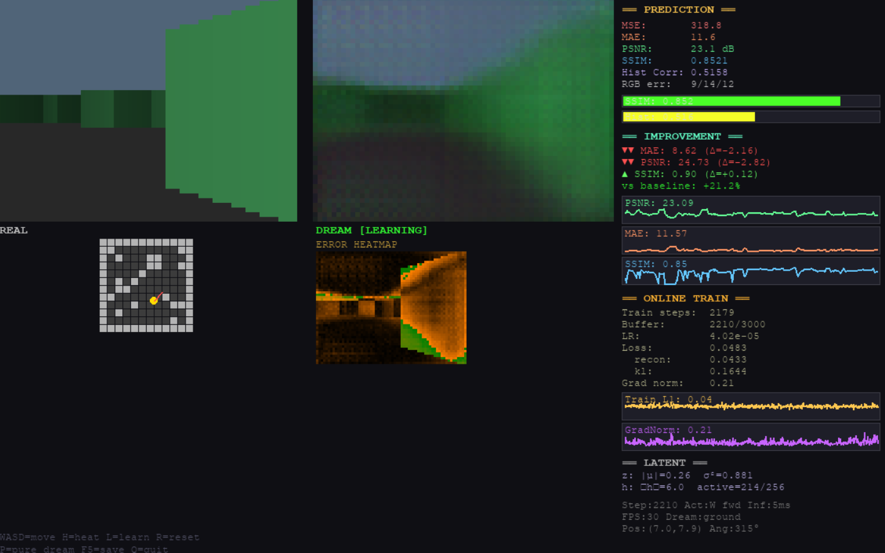

# Mini Dreamer
### Interactive World Model with Real-Time Online Learning


Mini Dreamer is an experimental **interactive world model** that learns to predict future observations **while you explore an environment in real time**.

The system continuously improves its predictions using **online learning, replay buffers, and latent dynamics**, while visualizing prediction quality and training metrics live.

This project serves as a minimal platform for exploring **predictive representation learning and world models**.

---

# Demo

[](assets/demo.mp4)

*Click the image to watch the demo video.*

The interface displays:

| Real Environment | Model Prediction |
|------------------|-----------------|
| Ground truth frame | Model's predicted next frame |

Additional panels visualize:

- prediction error heatmap  
- learning metrics  
- training curves  
- replay buffer statistics  
- latent state information  

As the agent explores the environment, the model **gradually improves its predictions in real time**.

---

# Key Features

### Interactive exploration

Explore a procedurally generated environment while the model learns.

```
WASD movement
camera rotation
minimap visualization
```

---

### World model architecture

The system learns a predictive latent representation of the environment.

Pipeline:

```
observation_t
     ↓
encoder
     ↓
latent state (z)
     ↓
RSSM recurrent dynamics
     ↓
decoder
     ↓
predicted observation_{t+1}
```

The model predicts the next observation conditioned on the current latent state and the executed action.

---

### Online learning during gameplay

The model updates continuously while the environment runs.

Training loop:

```
(obs_t, action, obs_t+1)
        ↓
    replay buffer
        ↓
    mini-batch sampling
        ↓
    gradient update
```

This enables **live learning while interacting with the environment**.

---

### Prediction quality metrics

Prediction accuracy is evaluated using multiple metrics:

- **MSE** - Mean Squared Error  
- **MAE** - Mean Absolute Error  
- **PSNR** - Peak Signal-to-Noise Ratio  
- **SSIM** - Structural Similarity  
- **Histogram Correlation**  
- **RGB Channel Error**

Metrics are tracked over time to measure **learning progress**.

---

### Live training visualization

The interface visualizes:

- prediction quality
- training loss
- gradient norms
- learning rate
- replay buffer size
- latent state statistics
- prediction error heatmaps

This makes the learning dynamics visible in real time.

---

### Pure Dream Mode

The model can run in **Pure Dream Mode**, where it generates predictions based only on its own previous predictions rather than real observations.

This allows exploration of the **internal generative dynamics** of the learned world model.

---

# Quick Start

Clone the repository:

```
git clone https://github.com/yourusername/mini-dreamer.git
cd mini-dreamer
```

Install dependencies:

```
pip install -r requirements.txt
```

Run the interactive environment:

```
python play_learn.py
```

---

# Controls

```
WASD   move
H      toggle error heatmap
L      toggle online learning
P      pure dream mode
R      reset latent state
F5     save model checkpoint
Q      quit
```

---

# Running With Options

```
python play_learn.py --ckpt model.pt --seed 7 --scale 6
```

Arguments:

```
--ckpt    model checkpoint
--seed    environment seed
--scale   rendering scale
```

---

# Architecture Overview

Mini Dreamer implements a simplified **world model architecture inspired by Dreamer-style systems**.

Core components:

```
Environment
    ↓
Observation Encoder
    ↓
Latent Representation (z)
    ↓
Recurrent State Space Model (RSSM)
    ↓
Decoder
    ↓
Predicted Observation
```

The recurrent latent state captures temporal dynamics of the environment, enabling the model to predict future observations conditioned on actions.

---

# Project Structure

```
mini-dreamer

play_learn.py
    interactive environment + online training

train.py
    world model training utilities

world_gen.py
    procedural environment generation

assets/
    demo video and preview image

checkpoints/
    saved model weights
```

---

# Training Objective

The model optimizes a combined objective:

```
L = reconstruction_loss + β · KL_divergence
```

Where

- **reconstruction loss** = L1 prediction error  
- **KL divergence** regularizes the latent representation  

This encourages learning a **compact predictive latent space**.

---

# Future Work

Potential extensions include:

- reinforcement learning agents
- curiosity-driven exploration
- transformer-based world models
- larger environments
- dataset logging for offline training
- multi-agent simulations

---

# Citation

If you use this project in research or experiments, please cite:

```
@software{mini_dreamer,
  author = {Tomasz Water},
  title = {Mini Dreamer: Interactive World Model with Online Learning},
  year = {2026},
  url = {https://github.com/yourusername/mini-dreamer}
}
```

---

# License

MIT License

---

# Author

Tomasz Wietrzykowski
